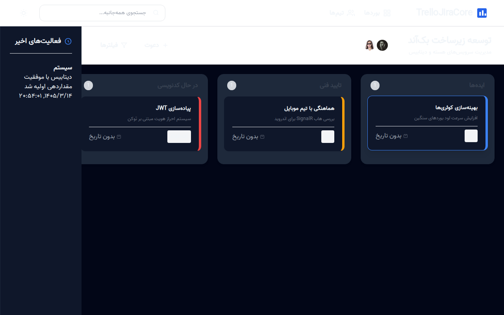

# TrelloJiraCore - سامانه جامع مدیریت پروژه

TrelloJiraCore یک پلتفرم قدرتمند برای مدیریت پروژه‌های چابک (Agile) است که با الهام از ویژگی‌های برتر Trello و Jira طراحی شده است. این سیستم از تکنولوژی SignalR برای ارائه تجربه کاربری کاملاً آنی (Real-time) استفاده می‌کند.

## قابلیت‌های کلیدی
- مدیریت بوردها، لیست‌ها و کارت‌ها به صورت سلسله‌مراتبی.
- به‌روزرسانی آنی تغییرات برای تمام کاربران آنلاین در یک بورد.
- ثبت خودکار تاریخچه فعالیت‌ها (Audit Trail).
- پشتیبانی از تم تاریک و روشن.
- معماری لایه‌ای (Clean Architecture) با قابلیت سوییچ بین دیتابیس‌های مختلف.

## پیش‌نیازها
- .NET 10 SDK
- SQL Server یا SQLite

## راه اندازی پروژه

### ۱. تنظیم دیتابیس
در فایل `appsettings.json` می‌توانید نوع دیتابیس را انتخاب کنید:
```json
"DatabaseProvider": "Sqlite",
"ConnectionStrings": {
  "DefaultConnection": "Data Source=TrelloJira.db"
}
```

### ۲. اجرای پروژه
برای اجرای پروژه دستور زیر را در پوشه ریشه پروژه وارد کنید:
```bash
dotnet run --project src/TrelloJiraCore.Web
```
پس از اجرا، دیتابیس به صورت خودکار ساخته شده و داده‌های اولیه (Seed Data) تزریق می‌شوند.

## راهنمای استفاده از رابط کاربری
سیستم شامل یک بورد کانبان پیش‌فرض است. شما می‌توانید کارت‌ها را بین ستون‌ها جابه‌جا کنید (Drag & Drop). هر جابه‌جایی به صورت آنی به سایر اعضا اطلاع‌رسانی می‌شود.

## اسکرین‌شات‌های سیستم




## معماری پروژه
- **Core:** شامل موجودیت‌ها، اینوم‌ها و اینترفیس‌های اصلی.
- **Infrastructure:** پیاده‌سازی دسترسی به داده‌ها با EF Core.
- **Web:** لایه API و رابط کاربری وب.
